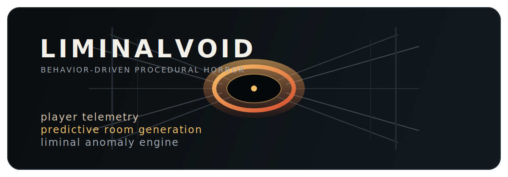
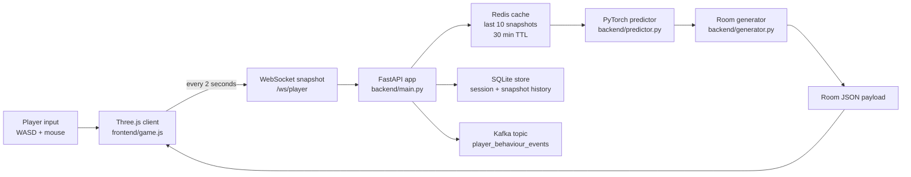
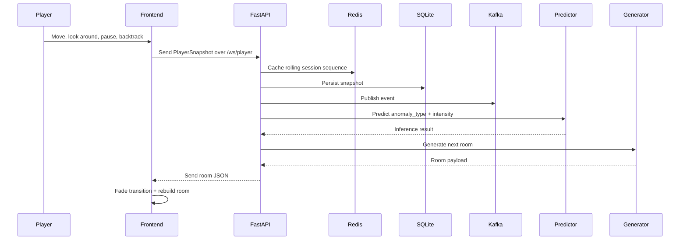
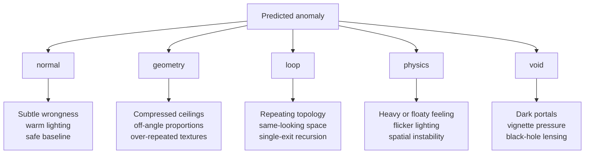

<p align="center">
  
</p>

<p align="center">
  <strong>A browser horror experiment where player behavior becomes the procedural generation system.</strong>
</p>

<p align="center">
  
  
  
  
  
  
</p>

## What LiminalVoid Is

LiminalVoid is a web-based liminal horror prototype. The player walks through a first-person corridor, the client captures movement and hesitation patterns, and the backend interprets those signals with a small transformer model to decide what kind of room should come next.

Instead of treating machine learning as an invisible scoring layer, this project makes the prediction legible: the model directly changes geometry, lighting, gravity, repetition, void intensity, and the emotional tone of the next space.

## Core Idea

The experience loop is simple:

1. The player explores a room rendered with Three.js.
2. The browser samples behavior every few seconds.
3. FastAPI stores and fans out those snapshots.
4. A PyTorch predictor classifies the current behavior pattern.
5. A procedural room generator returns a new liminal room payload.
6. The frontend rebuilds the space and the horror escalates.

That means the map is not random in the usual sense. It is a response to how the player moves, pauses, turns back, and lingers.

## Feature Highlights

- Real-time first-person corridor exploration with pointer-lock controls.
- WebSocket-driven gameplay loop with low-friction client/server sync.
- Behavioral telemetry captured as structured `PlayerSnapshot` events.
- Redis-backed rolling session memory for fast inference.
- SQLite persistence for sessions and snapshots.
- Kafka event publishing for external analytics or downstream consumers.
- PyTorch transformer classifier that predicts one of five room states.
- Procedural room generation for `normal`, `geometry`, `loop`, `physics`, and `void` anomalies.
- Post-processing effects including vignette and gravitational lensing for void portals.
- Zero frontend build step: the browser imports Three.js directly from CDN.

## System Architecture



## Runtime Sequence



## Room Taxonomy



## Behavioral Signals

The model currently consumes an 8-feature sequence with a maximum window of 10 recent snapshots:

| Feature key | Meaning in the game loop |
| --- | --- |
| `velocity` | How much the player moved during the sampling window |
| `direction_change` | Sudden changes in movement direction or large camera yaw shifts |
| `dwell_time` | Time spent standing still or lingering |
| `anamoly` | Whether the player was close to an anomaly |
| `anamoly_visibility` | Whether the anomaly was visible in the camera frustum |
| `backtrack` | Whether the player reversed toward an older path |
| `wall_closer` | Whether the player stayed near corridor boundaries |
| `pause` | Count of movement stops or hesitation moments |

Notes:

- The field names intentionally match the current codebase, including the existing `anamoly` spelling in the payload schema.
- If no model file exists, the backend trains one on first prediction and saves `spatial_transformer.pt`.

## Project Layout

```text
liminalvoid/
|- backend/
|  |- main.py            # FastAPI app, WebSocket loop, static mount
|  |- player_tracker.py  # Redis cache + Kafka publish
|  |- predictor.py       # Synthetic dataset, transformer, inference
|  |- generator.py       # Procedural room generation
|  |- database.py        # SQLite persistence
|  `- models.py          # Pydantic payload schema
|- frontend/
|  |- index.html         # HUD, overlay, importmap bootstrapping
|  |- game.js            # Input, telemetry, transitions, WebSocket client
|  |- renderer.js        # Room building, portals, lighting, post FX
|  `- shaders/
|     `- lensing.glsl    # Void portal distortion shader
|- docker-compose.yml
|- Dockerfile
`- requirements.txt
```

## How the Procedural Loop Works

### 1. Frontend exploration

The browser starts in a minimal intro overlay, locks the pointer on entry, and drives a first-person camera through a corridor. The renderer clamps movement to the current room bounds and monitors proximity to exits, anomalies, and walls.

### 2. Snapshot generation

`frontend/game.js` accumulates short behavioral windows and sends a snapshot roughly every 2 seconds. These payloads are small enough for real-time use but expressive enough to hint at fear, uncertainty, hesitation, and repetition.

### 3. Backend fan-out

When `backend/main.py` receives a snapshot, it:

- validates the payload with `PlayerSnapshot`
- stores the last few snapshots in Redis
- persists the snapshot in SQLite
- publishes the event to Kafka
- runs inference
- generates the next room and sends it back over the same socket

### 4. Prediction and generation

`backend/predictor.py` uses a transformer encoder with:

- sequence length: `10`
- input features: `8`
- attention heads: `5`
- latent size: `60`
- room classes: `5`

The model predicts both:

- `anomaly_type`
- `intensity`

`backend/generator.py` translates that prediction into spatial parameters such as:

- ceiling height
- corridor width
- lighting mode
- exit count
- texture repetition
- gravity feel
- loop target
- void pull strength

### 5. Visual payoff

`frontend/renderer.js` rebuilds the room instantly and layers mood through:

- texture changes
- lighting shifts
- room proportion changes
- anomaly meshes
- portal framing
- silhouette entities at high intensity
- vignette scaling
- lensing distortion around void exits

## API and Runtime Surface

| Route | Method | Purpose |
| --- | --- | --- |
| `/health` | `GET` | Basic service heartbeat |
| `/redis-check` | `GET` | Quick Redis connectivity check |
| `/train` | `POST` | Force model training for 30 epochs |
| `/snap` | `POST` | Submit a snapshot over HTTP instead of WebSocket |
| `/session/{session_id}` | `GET` | Read cached snapshots for a session |
| `/ws/player` | `WS` | Main gameplay telemetry and room generation loop |

## Running Locally

### Option A: Docker Compose

```bash
docker compose up --build
```

Then open `http://localhost:8000`.

### Option B: Run services manually

Start infrastructure:

```bash
docker compose up zookeeper kafka redis
```

Install Python dependencies:

```bash
pip install -r requirements.txt
```

Start the API:

```bash
uvicorn backend.main:app --reload
```

Then visit `http://localhost:8000` and click `ENTER`.

## What Makes This Project Interesting

Most procedural horror games randomize rooms. LiminalVoid instead tries to read the player and answer with a new space that reflects that behavior. The horror comes from the feeling that the environment is paying attention.

That gives the project a nice intersection of:

- interactive fiction and spatial horror
- real-time systems
- behavior modeling
- event streaming
- procedural generation
- shader-driven atmosphere

## Current Constraints and Next Steps

- The model is trained on synthetic archetypes, not real captured playtest sessions yet.
- Kafka is currently used as a producer target only; no consumer pipeline is included in this repo.
- CSP and WebSocket connection settings are tuned for local development.
- The room system is already expressive, but it can grow into more biome variation, audio cues, and persistent narrative state.

## Suggested Roadmap

1. Record real player sessions and retrain on observed behavior.
2. Add a Kafka consumer for analytics dashboards or offline balancing.
3. Persist full room history and use it for long-form narrative escalation.
4. Introduce sound design, ambient events, and reactive entity behavior.
5. Add replay and session visualization tools for debugging the ML loop.

## Repo Snapshot

LiminalVoid is already compelling as a prototype because all the major pieces are present in one codebase:

- a playable 3D frontend
- a real-time FastAPI backend
- a streaming/cache/storage layer
- a learned behavior-to-space mapping
- a consistent liminal horror aesthetic

If you want a README that presents the project like a portfolio piece, a hackathon submission, or a research-style prototype write-up, this structure is a strong base for any of those directions.
